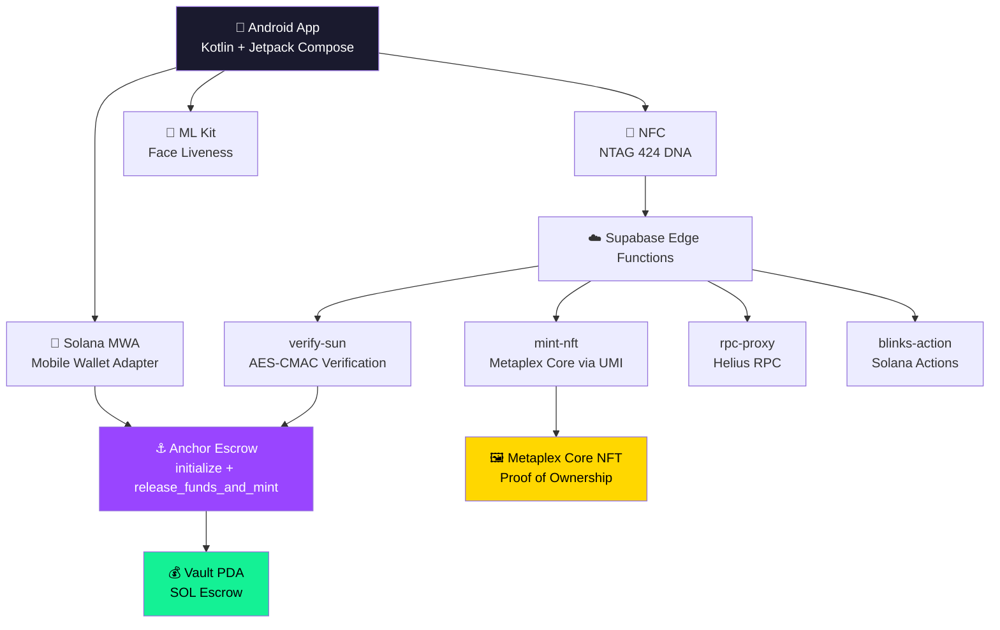

<div align="center">
  
  
  # Aura

  **The Physical-to-Digital Marketplace — Trustless P2P Commerce on Solana**

  [](https://kotlinlang.org/)
  [](https://www.android.com/)
  [](https://developer.android.com/jetpack/compose)
  [](https://solana.com/)
  [](https://www.nxp.com/products/rfid-nfc/nfc-hf/ntag/ntag-424-dna:NTAG424DNA)
  [](https://www.metaplex.com/)
</div>

---

## 🎯 The Problem

Peer-to-peer marketplaces like Craigslist and Facebook Marketplace have a **$200B+ trust problem**. Buyers can't verify item authenticity before meeting. Sellers risk no-shows. Cash payments have zero fraud protection. And there's no proof of ownership transfer.

## 💡 The Solution: Aura

Aura is a **Solana-native Android marketplace** that uses **NFC cryptographic verification**, **on-chain escrow**, and **Metaplex Core NFTs** to create trustless, fraud-proof physical goods transactions. Every handover is cryptographically verified, funds are protected by smart contracts, and ownership is permanently recorded on-chain.

---

## 🔄 How It Works

```
1. LIST        → Seller photographs item, sets price, gets on-chain fingerprint
2. MATCH       → Buyer funds Anchor escrow (SOL locked in vault PDA)
3. MEET        → Both parties meet; ML Kit face liveness verifies identity
4. TAP (NFC)   → NTAG 424 DNA tag produces SUN URL with AES-CMAC signature
5. RELEASE     → Backend verifies NFC cryptographic proof → escrow releases → cNFT mints
```

> **Key Innovation:** The NFC tap creates a cryptographic proof-of-handover that's verified server-side before funds are released. No trust required.

---

## 🏗️ Architecture



---

## ✨ Features

### Core Marketplace
- 🏪 **Listings Grid** — Browse items with real-time pricing in SOL
- 📸 **Camera Capture** — CameraX-powered photo capture with macro texture scanning
- 🔐 **Anchor Escrow** — SOL locked in vault PDA until cryptographic verification
- 📲 **NFC Handover** — NTAG 424 DNA SUN URL with CMAC signature verification
- 🖼️ **NFT Receipt** — Metaplex Core cNFT minted on trade completion

### Trust Layer
- 👤 **Face Liveness** — Google ML Kit real-time biometric verification
- 🔍 **Aura Check** — AI-powered item authenticity scanning via CameraX
- 📊 **Aura Score** — Reputation system based on trade history
- 🔥 **Streak Tracking** — Gamified engagement with daily streaks

### Solana Native
- 💼 **Mobile Wallet Adapter** — Native Solana wallet connection (Phantom, Solflare)
- ⚡ **Solana Blinks** — Share listings as executable Actions on Twitter/Discord
- 🏗️ **PDA Derivation** — Client-side Anchor PDA computation for escrow + vault
- 📡 **Helius RPC** — Production-grade RPC via Edge Function proxy

### Gamification & Engagement
- 🎯 **Directives** — Gamified task challenges with haptic feedback
- 🏆 **Rewards** — XP, badges, and tier progression
- 🗺️ **Zone Refinement** — Camera-based territorial scanning
- ⚙️ **Settings** — Notifications, appearance, security, privacy sub-screens

---

## 🛠️ Tech Stack

| Layer | Technology |
|-------|-----------|
| **Language** | Kotlin 2.0 |
| **UI** | Jetpack Compose + Material3 + Lottie |
| **Blockchain** | Solana (MWA 2.1, Anchor, Metaplex Core) |
| **Smart Contract** | Rust / Anchor Framework |
| **NFC** | NTAG 424 DNA (IsoDep + HCE) |
| **Biometrics** | Google ML Kit Face Detection + CameraX |
| **Backend** | Supabase (PostgREST, Auth, Storage, Realtime, Edge Functions) |
| **RPC** | Helius (via Edge Function proxy) |
| **QR Codes** | ZXing |
| **Image Loading** | Coil |
| **Animations** | Lottie + Spring Physics |
| **Data** | DataStore Preferences |

---

## 📁 Project Structure

```
├── app/src/main/java/com/aura/app/
│   ├── data/                    # Repository, Supabase clients, managers
│   │   ├── AuraRepository.kt   # Central CRUD (listings, trades, escrow, profiles)
│   │   ├── SupabaseClient.kt   # Supabase initialization
│   │   ├── DirectivesManager.kt
│   │   ├── HotzoneManager.kt
│   │   └── TradeRiskOracle.kt
│   ├── model/                   # Domain models (11 files)
│   ├── navigation/              # NavGraph + Routes (17 destinations)
│   ├── ui/
│   │   ├── components/          # AppLogo, AuraComponents, CoreRenderer, ShimmerEffect
│   │   ├── screen/              # 17 screens (Onboarding → TradeComplete)
│   │   ├── theme/               # Glassmorphism design system
│   │   └── util/                # HapticEngine, springScale
│   ├── util/                    # NfcHandoverManager, AuraHceService, FaceAnalyzer
│   └── wallet/                  # WalletConnectionState, AnchorTransactionBuilder, SolanaRpc
├── smart_contracts/
│   └── aura_escrow/programs/    # Anchor Rust program (initialize + release_funds_and_mint)
├── supabase/
│   ├── functions/               # 7 Edge Functions
│   │   ├── verify-sun/          # NFC CMAC verification + escrow release
│   │   ├── mint-nft/            # Metaplex Core minting via UMI
│   │   ├── blinks-action/       # Solana Actions (Twitter/Discord unfurl)
│   │   ├── rpc-proxy/           # Helius RPC proxy
│   │   ├── verify-photo/
│   │   ├── aura-core-nft/
│   │   └── mint-aura-token/
│   └── migrations/              # PostgreSQL schema + RLS policies
```

---

## 🚀 Getting Started

### Prerequisites

- Android Studio Ladybug or later
- JDK 17+
- Android SDK 26+ (Android 8.0+)
- Solana wallet app (Phantom / Solflare) on device

### Build & Run

```bash
git clone https://github.com/arjun-kuttikkat/Aura.git
cd Aura
./gradlew assembleDebug
```

### Supabase Setup

1. Create a Supabase project
2. Run `supabase/migrations/001_schema.sql` in SQL Editor
3. Deploy edge functions: `supabase functions deploy`
4. Set env vars: `NFC_MASTER_AES_KEY`, `SOLANA_AUTHORITY_KEY`, `HELIUS_API_KEY`

---

## 👥 Team

- **Arjun Kuttikkat** 
- **Wasif Waseem**
- **Huaicheng Su** 

---

## 📄 License

MIT License — see [LICENSE](LICENSE)

---

<div align="center">
  <b>Built on Solana · Verified by NFC · Secured by Anchor</b>
</div>
