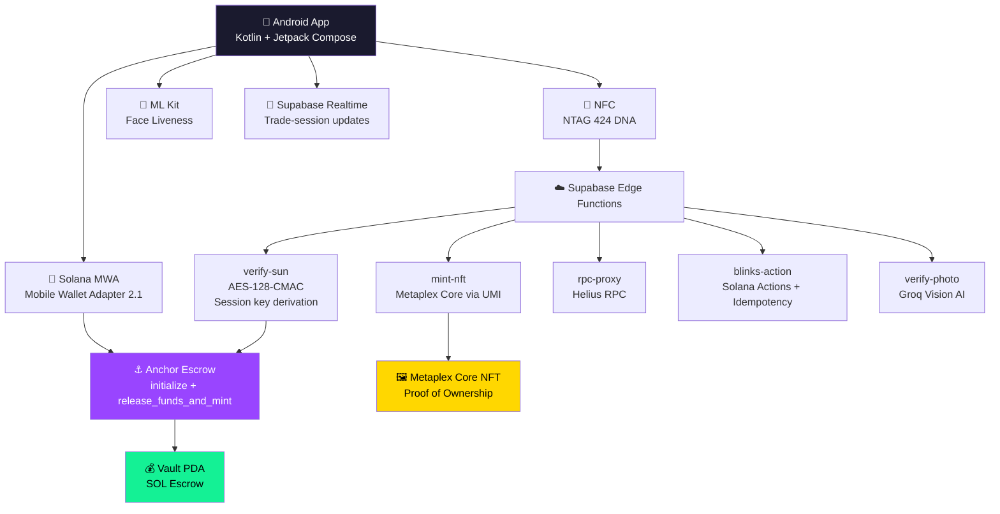

<div align="center">
  
  
  # Aura

  **The Physical-to-Digital Marketplace — Trustless P2P Commerce on Solana**

  [](https://kotlinlang.org/)
  [](https://www.android.com/)
  [](https://developer.android.com/jetpack/compose)
  [](https://solana.com/)
  [](https://www.nxp.com/products/rfid-nfc/nfc-hf/ntag/ntag-424-dna:NTAG424DNA)
  [](https://www.metaplex.com/)
  [](LICENSE)
</div>

---

> **Hackathon Submission** — Aura was built for the Solana hackathon to prove that
> *real-world commerce can be as trustless as DeFi*. Every line of code, from the
> Anchor escrow to the NTAG 424 DNA CMAC verifier, targets a single goal:
> **zero-trust physical handovers, settled on-chain in seconds.**

---

## 🎯 The Problem

Peer-to-peer marketplaces like Craigslist and Facebook Marketplace have a **$200B+ trust problem**:

| Pain Point | Status Quo | Aura's Answer |
|---|---|---|
| **Item Authenticity** | Buyers can't verify before meeting | AI photo check + NFC crypto tag |
| **Payment Risk** | Cash has zero fraud protection | SOL locked in Anchor escrow PDA |
| **No-shows / Scams** | No accountability | On-chain Aura Score reputation |
| **Ownership Transfer** | "I already sold it" disputes | Metaplex Core NFT receipt on-chain |

## 💡 The Solution: Aura

Aura is a **Solana-native Android marketplace** that uses **NFC cryptographic verification**, **on-chain escrow**, and **Metaplex Core NFTs** to create trustless, fraud-proof physical goods transactions. Every handover is cryptographically verified, funds are protected by smart contracts, and ownership is permanently recorded on-chain.

---

## 🔄 How It Works

```
 ┌──────────┐    ┌──────────┐    ┌──────────┐    ┌──────────┐    ┌──────────┐
 │  1. LIST │───▶│ 2. MATCH │───▶│ 3. MEET  │───▶│ 4. TAP   │───▶│ 5. DONE  │
 │  Photo + │    │ Buyer    │    │ ML Kit   │    │ NTAG 424 │    │ Escrow   │
 │  Price   │    │ funds    │    │ liveness │    │ DNA CMAC │    │ releases │
 │          │    │ escrow   │    │ check    │    │ verified │    │ NFT mint │
 └──────────┘    └──────────┘    └──────────┘    └──────────┘    └──────────┘
```

1. **LIST** — Seller photographs item, sets price in SOL, AI verifies photo authenticity
2. **MATCH** — Buyer funds Anchor escrow (SOL locked in a vault PDA on-chain)
3. **MEET** — Both parties meet in person; ML Kit face liveness confirms identity
4. **TAP** — NTAG 424 DNA tag produces a SUN URL with AES-128-CMAC signature
5. **DONE** — Edge Function verifies CMAC proof → escrow releases SOL → Metaplex Core NFT mints

> **Key Innovation:** The NFC tap creates a **cryptographic proof-of-handover** that is
> verified server-side before funds are released. No trust required — only math.

---

## 📖 The Aura Experience (Demo Walkthrough)

To understand how Aura transforms physical commerce, here is a step-by-step walkthrough of a real transaction and our gamified trust system:

**1. Listing & AI Verification**
The seller lists an item using our native camera to take macro-level close-ups. Our AI (Groq Vision) scans the physical details and instantly creates a permanent, tamper-proof digital receipt on Solana for a fraction of a cent.

**2. Secure Chat & Escrow**
A buyer finds the item. To eliminate spam bots, opening a chat requires a micro-fee in Aura points. After agreeing on a price, the buyer locks their funds directly into a secure Anchor smart contract. The funds are safe, allowing both parties to confidently arrange a meetup.

**3. Location & Liveness Check**
At the meetup, the app utilizes GPS to confirm both phones are in close proximity before the transfer process can begin. The buyer scans the item, and the AI matches it against the original digital record to ensure authenticity and prevent bait-and-switch scams.

**4. Cryptographic Handover**
Once satisfied, the buyer and seller simply tap their phones together. A background NFC read instantly triggers the smart contract to release the funds directly to the seller. In case of NFC failure, a secure, dynamic QR code serves as a fallback.

**5. Building Trust (The Aura Core)**
Trust on Aura is earned, not bought. Central to the user profile is the **Aura Core**—a 3D representation of a user's reliability. New users start with a dim spark that grows brighter with consistent app usage and successful trades. 

**6. Wellness & Anti-Sybil Missions**
To grow their Core, users interact with a built-in AI guide that provides custom daily missions (e.g., taking a photo of a local landmark). The smart camera enforces physical presence, preventing spoofing via screenshots. This builds a healthy habit and acts as a robust anti-Sybil mechanism.

**7. Ranks & Rewards**
Completing physical missions earns stars, moving users up the ranking system. Reaching the top "Radiant" rank unlocks zero-fee transactions. However, missing daily streaks causes the Aura Core to visibly decay, transparently reflecting activity levels.

**8. Hotzones & Territorial Dominance**
Highly active sellers can claim "Hotzones" (physical geographic areas). Controlling a zone prioritizes the seller's items in local searches and earns them a protocol fee cut from trades occurring within their territory.

This combination of hardware-verified trades and gamified, daily engagement turns local commerce into a secure, positive, and habit-forming experience.

---

## 🏗️ Architecture



---

## ✨ Features

### Core Marketplace
- 🏪 **Listings Grid** — Browse items with real-time pricing in SOL, pull-to-refresh
- 📸 **Camera Capture** — CameraX-powered photo capture with macro texture scanning
- 🔐 **Anchor Escrow** — SOL locked in vault PDA until cryptographic verification completes
- 📲 **NFC Handover** — NTAG 424 DNA SUN URL with AES-128-CMAC signature verification
- 🖼️ **NFT Receipt** — Metaplex Core NFT minted on trade completion as proof of ownership
- 💬 **In-app Chat** — Real-time messaging between buyer and seller via Supabase Realtime

### Trust & Security Layer
- 👤 **Face Liveness** — Google ML Kit real-time biometric verification at meetup
- 🔍 **Aura Check** — AI-powered item authenticity scanning via Groq Vision (llama-4-scout)
- 📊 **Aura Score** — On-chain reputation system based on verified trade history
- 🔥 **Streak Tracking** — Gamified engagement with daily scan streaks
- 🛡️ **Risk Oracle** — Per-trade risk assessment using seller Aura Score before committing funds
- ✅ **Confirmation Dialogs** — Escrow release, wallet disconnect, and trade start all require explicit confirmation

### Solana Native
- 💼 **Mobile Wallet Adapter 2.1** — Native connection to Phantom, Solflare, and other MWA wallets
- ⚡ **Solana Blinks** — Share listings as executable Actions on Twitter/Discord with idempotency guard
- 🏗️ **Client-side PDA Derivation** — Anchor PDA computation for escrow + vault without RPC calls
- 📡 **Helius RPC** — Production-grade RPC via Edge Function proxy (no exposed API keys)

### Gamification & Engagement
- 🎯 **Directives** — Gamified task challenges (Spatial Sweep, Guardian Witness, Texture Archive)
- 🏆 **Rewards** — XP, badges, and tier progression
- 🗺️ **Hotzones** — H3-indexed geographic trading zones with turf leaderboards
- ⚙️ **Settings** — Notifications, appearance, security, privacy sub-screens

---

## 🔒 Security Model

| Layer | Protection |
|-------|-----------|
| **Funds** | SOL locked in Anchor PDA vault; only released after server-verified NFC proof |
| **NFC** | NTAG 424 DNA: AES-128-CMAC with session key derivation (SV2 counter-bound) |
| **Database** | Row Level Security on every table; JWT `wallet_address` claim via `requesting_wallet()` |
| **Secrets** | All API keys in `local.properties` → BuildConfig; never committed to VCS |
| **RPC** | Helius endpoint proxied through Edge Function; client never sees raw key |
| **Release Build** | R8 full mode, ProGuard rules for OkHttp / Bouncy Castle / Compose / CameraX |
| **Photo Verify** | Groq Vision AI validates item photos server-side before listing is accepted |

---

## 🛠️ Tech Stack

| Layer | Technology |
|-------|-----------|
| **Language** | Kotlin 2.0 |
| **UI** | Jetpack Compose + Material3 + Lottie |
| **Blockchain** | Solana (MWA 2.1, Anchor, Metaplex Core) |
| **Smart Contract** | Rust / Anchor Framework |
| **NFC** | NTAG 424 DNA (IsoDep + HCE) |
| **Biometrics** | Google ML Kit Face Detection + CameraX |
| **Backend** | Supabase (PostgREST, Auth, Storage, Realtime, Edge Functions) |
| **RPC** | Helius (via Edge Function proxy) |
| **QR Codes** | ZXing |
| **Image Loading** | Coil |
| **Animations** | Lottie + Spring Physics |
| **Data** | DataStore Preferences |

---

## 📁 Project Structure

```
├── app/src/main/java/com/aura/app/
│   ├── data/                    # Repository, Supabase clients, managers
│   │   ├── AuraRepository.kt   # Central CRUD (listings, trades, escrow, profiles)
│   │   ├── SupabaseClient.kt   # Supabase initialization
│   │   ├── DirectivesManager.kt
│   │   ├── HotzoneManager.kt
│   │   └── TradeRiskOracle.kt
│   ├── model/                   # Domain models (11 files)
│   ├── navigation/              # NavGraph + Routes (17 destinations)
│   ├── ui/
│   │   ├── components/          # AppLogo, AuraComponents, CoreRenderer, ShimmerEffect
│   │   ├── screen/              # 17 screens (Onboarding → TradeComplete)
│   │   ├── theme/               # Glassmorphism design system
│   │   └── util/                # HapticEngine, springScale
│   ├── util/                    # NfcHandoverManager, AuraHceService, FaceAnalyzer
│   └── wallet/                  # WalletConnectionState, AnchorTransactionBuilder, SolanaRpc
├── smart_contracts/
│   └── aura_escrow/programs/    # Anchor Rust program (initialize + release_funds_and_mint)
├── supabase/
│   ├── functions/               # 7 Edge Functions
│   │   ├── verify-sun/          # NFC CMAC verification + escrow release
│   │   ├── mint-nft/            # Metaplex Core minting via UMI
│   │   ├── blinks-action/       # Solana Actions (Twitter/Discord unfurl)
│   │   ├── rpc-proxy/           # Helius RPC proxy
│   │   ├── verify-photo/
│   │   ├── aura-core-nft/
│   │   └── mint-aura-token/
│   └── migrations/              # PostgreSQL schema + RLS policies
```

---

## 🚀 Getting Started

### Prerequisites

- Android Studio Ladybug or later
- JDK 17+
- Android SDK 26+ (Android 8.0+)
- Solana wallet app (Phantom / Solflare) on device

### Build & Run

```bash
git clone https://github.com/arjun-kuttikkat/Aura.git
cd Aura
./gradlew assembleDebug
```

### 🔑 1. Environment Secrets (`local.properties`)

Aura uses `local.properties` to manage sensitive API keys. This file is excluded from Git to keep your credentials safe.

1.  **Create the file**: Copy `local.properties.example` to `local.properties`.
2.  **Fill in the following keys**:

#### **A. Supabase (Backend & Auth)**
- **Get the keys**: Go to your [Supabase Dashboard](https://supabase.com/dashboard) → Project Settings → API.
- `SUPABASE_URL`: Your project's API URL.
- `SUPABASE_KEY`: Your `anon` (public) key.
- `SUPABASE_JWT_SECRET`: Found in Project Settings → API → JWT Settings. Required for Edge Function auth.

#### **B. Groq AI (Vision & Intelligence)**
- **Get the key**: Create an account at [console.groq.com](https://console.groq.com/keys).
- `GROQ_API_KEY`: Your Groq API key.
- `GROQ_MODEL`: Set to `meta-llama/llama-4-scout-17b-16e-instruct` (recommended for Aura).

#### **C. Helius (Solana RPC)**
- **Get the key**: Sign up at [helius.dev](https://www.helius.dev/) for a free-tier RPC node.
- `HELIUS_RPC_URL`: Format: `https://mainnet.helius-rpc.com/?api-key=YOUR_KEY`. Aura uses this to communicate with the Solana blockchain.

#### **D. Google Maps (Location Services)**
- **Get the key**: Visit the [Google Cloud Console](https://console.cloud.google.com/).
- **Enable API**: Enable the "Maps SDK for Android".
- **Restrict Key**: Ensure you restrict the key to the Android platform using your app's package name (`com.aura.app`) and SHA-1 fingerprint.
- `MAPS_API_KEY`: Your restricted Google Maps API key.

#### **E. Solana Authority & Treasury**
- `SOLANA_AUTHORITY_KEY`: The Base58 private key of the wallet that will act as the platform authority (for minting NFTs and managing escrow). **Warning: Never use a main wallet for this.**
- `TREASURY_WALLET`: The Base58 **Public Key** where protocol fees or escrow holds are sent.

---

### 🗄️ 2. Database Setup (Supabase)

1. **Initialize Schema**: Go to the SQL Editor in Supabase.
2. **Run Migrations**: Open and execute the SQL files in `supabase/migrations/` in chronological order. **Critical:** Ensure `001_schema.sql` is run first.
3. **Storage Configuration**:
   - The migration `20260305120000_storage_listing_images.sql` creates a `listing-images` bucket.
   - **Manual Check**: Verify in Supabase Dashboard → Storage that `listing-images` exists and its privacy is set to **Public**.
4. **Enable Realtime**:
   - Go to Database → Replication → `supabase_realtime` publication.
   - Add the `listings` and `trade_sessions` tables to the publication.
5. **Deploy Edge Functions**:
   Aura uses multiple Edge Functions for secure on-chain operations and AI validation.
   ```bash
   # Essential Functions
   supabase functions deploy wallet-auth      # Handles Solana wallet-based login
   supabase functions deploy verify-sun       # NFC CMAC verification
   supabase functions deploy verify-photo     # Groq Vision AI validation
   supabase functions deploy rpc-proxy        # Helius RPC proxying
   
   # Trading & Escrow
   supabase functions deploy mint-nft         # Metaplex Core minting
   supabase functions deploy release-escrow-photo
   supabase functions deploy promote-listing
   
   # Metadata & Aura System
   supabase functions deploy receipt-metadata
   supabase functions deploy mint-receipt-nft
   supabase functions deploy aura-core-nft
   supabase functions deploy mint-aura-token
   supabase functions deploy blinks-action    # Solana Blinks support
   ```
6. **Set Function Secrets**:
   Provide your keys to the Supabase environment. This is critical for authentication and RPC proxying:
   ```bash
   # Auth & Encryption
   supabase secrets set JWT_SECRET=your_jwt_secret         # Must match Project Settings -> API
   supabase secrets set NFC_MASTER_AES_KEY=your_key        # For NTAG 424 DNA verification
   
   # Blockchain & AI
   supabase secrets set HELIUS_API_KEY=your_key            # Proxied via rpc-proxy
   supabase secrets set SOLANA_AUTHORITY_KEY=your_key      # Wallet for minting/escrow
   supabase secrets set GROQ_API_KEY=your_key              # For verify-photo
   ```

---

### 📡 3. Hardware & Wallet Requirements ("The Rest")

To test Aura's core features (Proof-of-Handover), you need the following:

#### **A. NFC Hardware (NTAG 424 DNA)**
- Aura requires **NXP NTAG 424 DNA** tags for cryptographic security.
- Standard NTAG213/215 tags **will not work** as they lacks AES-128-CMAC support.
- The tags must be configured with a Diversified Key matching your `NFC_MASTER_AES_KEY`.

#### **B. Solana Mobile Wallet Adapter (MWA)**
- You must have a Solana wallet app (Phantom, Solflare, etc.) installed on your Android device.
- Ensure the wallet is set to **Devnet** or **Mainnet** depending on your `HELIUS_RPC_URL`.

#### **C. Biometrics**
- Aura uses Google ML Kit for Face Liveness. This works best on physical devices with a front-facing camera.

---

### 📦 4. Build Environment

- **IDE**: Android Studio Ladybug (2024.2.1) or newer.
- **SDK**: Android SDK 34 (API 26 minimum).
- **Gradle**: The project uses Version Catalogs (`libs.versions.toml`).

---

## 👥 Team

- **Arjun Kuttikkat** 
- **Wasif Waseem**
- **Huaicheng Su** 

---

## 📄 License

MIT License — see [LICENSE](LICENSE)

---

<div align="center">
  <b>Built on Solana · Verified by NFC · Secured by Anchor</b>
</div>
